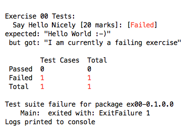

# Exercise 00

A simple end-to-end test of the CS3016 exercise system.

## Prerequisite

You have installed `stack`.

## Task

1. Open a command-line window and navigate to CS3016-1718/Exercise00
2. Enter `stack test`. 
3. If this is your first time running `stack` in one of the CS3018 Exercise folders, you my have to wait while `stack` ensures it has access to the correct versions of both the Haskell compiler and libraries. This delay should only happen once.
4. Eventually `stack` will compile, build and test the code. A lot of logging "stuff" will scroll past, ending with something like this:
5. The test fails: read the test outcome carefully. 
6. Your task is to edit `src/Ex00.hs` to modify it so the test succeeds.
7. To submit, simply upload **only** your revised Ex00.hs file to Blackboard. 